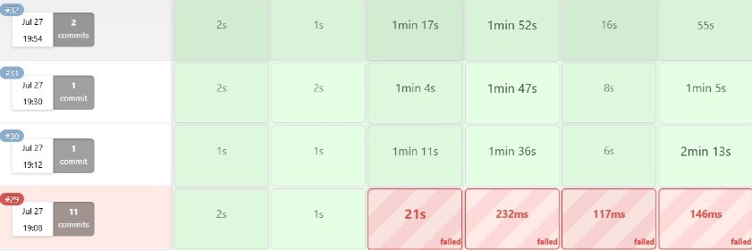

# 📄 DevOps Pipeline Automation – Project Report

This project demonstrates a complete end-to-end DevOps automation pipeline using **Terraform**, **Ansible**, **Jenkins**, **Git**, **GitHub**, and **Docker**. The objective is to provision infrastructure on AWS, configure the environment, and deploy a Dockerized Node.js application using CI/CD practices.

---

## 🏗 Architecture Diagram

### Flow Overview:

1. **GitHub** hosts the application source code and triggers the pipeline through a webhook.
2. **Jenkins** serves as the CI/CD tool to automate build, test, and deployment stages.
3. **Terraform** is used to provision AWS infrastructure (EC2, VPC, Security Groups).
4. **Ansible** automates the configuration of the EC2 instance (Docker installation, container deployment).
5. **Docker** packages and runs the Node.js app in a lightweight container.

> 📌 The deployed application is made publicly accessible via the EC2 instance's Elastic IP.


---

## 🌿 Branching Strategy

The Git repository follows a **GitFlow-inspired branching strategy**:

- `main`: Production-ready, stable code. Protected with PR reviews.
- `develop`: Active development branch. All features are integrated here before merging into `main`.
- `feature/*`: Temporary branches created from `develop` to work on new features or fixes.

🔁 **Pull Requests** are used to merge changes into `main` after successful testing and code review.

---

## ☁ Infrastructure Provisioning with Terraform

The infrastructure is provisioned on AWS using Terraform, including compute, network, and security components.

### Resources Created:

| Resource             | Description                                                  |
|----------------------|--------------------------------------------------------------|
| `aws_instance`       | EC2 instance to host the application                         |
| `aws_security_group` | Allows SSH (22), HTTP (80), and Jenkins (8080) traffic       |
| `aws_key_pair`       | SSH key to securely access the EC2 instance                  |
| `provider`           | AWS provider configuration (`region = ap-south-1`)           |

### Commands Used:

```bash
terraform init
terraform plan
terraform apply

🧰 Tools and Technologies
| Tool          | Role                                                      |
| ------------- | --------------------------------------------------------- |
| **Terraform** | Infrastructure as Code (EC2, networking, security)        |
| **Ansible**   | Configuration management (Docker, app deployment)         |
| **Jenkins**   | CI/CD automation (pipeline orchestration)                 |
| **Git**       | Version control                                           |
| **GitHub**    | Remote code repository + webhook integration with Jenkins |
| **Docker**    | Containerization of the Node.js application               |

🔁 Jenkins CI/CD Pipeline Overview
The Jenkins pipeline is fully automated using a Jenkinsfile. It performs the following tasks in sequential stages:

Pipeline Stages:
Code Checkout

Clones the develop branch from GitHub.

Terraform Apply

Provisions required AWS infrastructure.

Ansible Deployment

Connects to EC2 via SSH and configures the instance.

Installs Docker and deploys the container.

Docker Build & Push

Uses build_and_push.sh to push the Docker image to DockerHub.

Pipeline Stages or Logs:


